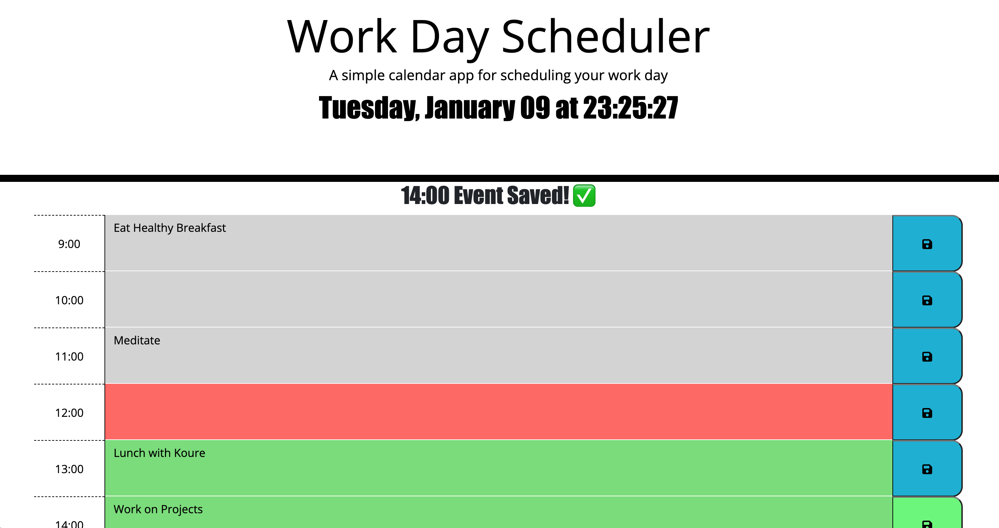

# Daily Planner App

## Description

In this project I was required to create a daily planner app, much like Google Calendar. This app allows the user to set out their day by saving their events in the time blocks.

Once each event is saved they will persist even if the browser tab is closed or refreshed.

_Find the link to the the deployed website [here](https://prodigalprogrammer.github.io/)_

(<a href="#daily-planner-app" >Back to top</a>)

## Usage

This app has a very accurate clock and updates every second. Once you scroll down to the time blocks, you will see they are colour-coded to show which hour in the day you are currently on plus the past and future events.

When you save your event, there is a confirmation message at the top and lets you know which hour you saved your event in. The save button also changes to green to display your last choice. There is also a message if you try to enter a blank event. This app will prohibit you from doing so.

(<a href="#daily-planner-app" >Back to top</a>)

## Features

### jQuery

- Learned a lot through jQuery. Very powerful API that allows you to do so much with so little code.

### LocalStorage

- This app would not be possible without `localStorage` and a permenant place to store all the events.

### For Loop

- The For Loop made creating this a lot easier as many parts of the code are repetitive.

(<a href="#daily-planner-app" >Back to top</a>)

## License

Distributed under the MIT License. See `LICENSE.txt` for more information.

## Contact

Project Link: [https://github.com/prodigalProgrammer/daily-planner-app](https://github.com/prodigalProgrammer/daily-planner-app)

Monrone Stewart: [YouTube](https://www.youtube.com/@ProdigalP) - prodigalprogrammer7@gmail.com

(<a href="#daily-planner-app" >Back to top</a>)

## Acknowledgement

- [GitHub Pages](https://pages.github.com/)
- [The Complete JavaScript Course 2024: From Zero to Expert!](https://www.udemy.com/course/the-complete-javascript-course/)

(<a href="#daily-planner-app" >Back to top</a>)

